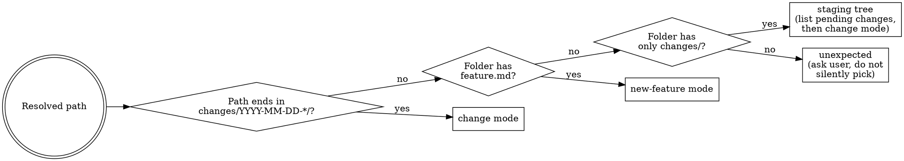

## Overview

Runs **after** implementation lands. Detects mode from the resolved
folder shape, runs drift detection over an explicit implementation
commit range, gates on open questions, applies confirmed edits, then
either promotes the proposed folder into `docs/features/implemented/`
(new-feature mode) or applies the delta files onto the implemented spec
and archives the change folder (change mode).

Implementation planning is intentionally **not** part of this skill — it runs
after implementation, not before. Use `implement-feature` to design, plan, and
build the spec into code (the step before this one).

Part of the feature-spec lifecycle: see
`../refine-feature/references/lifecycle.md` for the full workflow map
and redirect rules.

## When to use

- A new feature drafted under `docs/features/proposed/F-XXX-*/` has been
  implemented and the user wants to promote it to `implemented/`.
- A change spec under `docs/features/proposed/F-XXX-*/changes/YYYY-MM-DD-*/`
  has been implemented and the user wants its deltas applied onto the
  implemented spec.
- The user wants to fix drift between an in-flight spec and shipped
  code as part of either of the above.

When NOT to use (redirect instead):

- Implementation has not happened yet → no work for this skill. Use
  `refine-feature` (for a not-yet-shipped feature) or `change-feature`
  (for a change against a shipped feature) to finish drafting first.
- The feature has never been started → use `refine-feature`.

## Mode detection at a glance

| Resolved path shape                                                              | Mode                 | Notes                                                                                                                                                                                           |
| -------------------------------------------------------------------------------- | -------------------- | ----------------------------------------------------------------------------------------------------------------------------------------------------------------------------------------------- |
| `docs/features/proposed/F-XXX-*/changes/YYYY-MM-DD-*/`                           | **change mode**      | Reconcile the named change.                                                                                                                                                                     |
| `docs/features/proposed/F-XXX-*/` containing `feature.md`                        | **new-feature mode** | Reconcile then promote to `implemented/`.                                                                                                                                                       |
| `docs/features/proposed/F-XXX-*/` containing only `changes/` (no `feature.md`)   | staging tree         | Feature lives in `implemented/`. List pending changes and ask which to reconcile (then change mode against that change folder).                                                                 |
| `docs/features/proposed/F-XXX-*/` containing neither `feature.md` nor `changes/` | **unexpected**       | Surface contents and ask: abandon (use `refine-feature`), treat as new-feature (bootstrap `feature.md`), or treat as staging-tree (user knows `changes/` should be there). Never silently pick. |



## 1. Resolve the working item

The user may pass a path or feature title as $ARGUMENT, or omit it.

- If $ARGUMENT is given, resolve it: either a feature folder (`docs/features/proposed/F-XXX-feature-title/`) or a change folder (`docs/features/proposed/F-XXX-feature-title/changes/YYYY-MM-DD-change-title/`).
- If $ARGUMENT is omitted, check the current session context for a clearly-implied working feature or change (for example, the user just finished implementing it in this session). Use that if unambiguous.
- If neither argument nor session context resolves, list candidates under `docs/features/proposed/` and ask the user to pick.

## 2. Detect the mode from the resolved path

Apply the rules in "Mode detection at a glance" above (table + decision flow) to determine whether this invocation is **new-feature mode**, **change mode**, the staging-tree fallback, or an unexpected state. Resolve any user-prompted choice (staging-tree pending-changes pick, unexpected-state classification) before proceeding to §3.

## 3. Pre-flight checks

- **Directory name check.** If `docs/feature/` (singular) exists instead of `docs/features/`, stop and recommend renaming before proceeding. If the user agrees: run `git mv docs/feature docs/features` (or plain `mv` + `git add docs/features` if untracked — verify with `git ls-files --error-unmatch docs/feature 2>/dev/null`). Commit immediately via the `git-commit` skill with message `docs: rename docs/feature to docs/features`, then continue using `docs/features/`.
- If the working tree is dirty, refuse to run. Ask the user to commit or stash first.
- Confirm the git branch is appropriate per the project's branch rules.

## 4. Drift detection

This runs once, before any spec edits or moves, in both modes.

1. **Establish the baseline.** What "the spec" means depends on the mode:
   - **New-feature mode**: the baseline is the proposed `feature.md` and its `stories/` and `use-cases/` files. Drift = differences between that spec and what shipped.
   - **Change mode**: the baseline for each delta is the delta file's "Full revised content" body (not the pre-change implemented spec, and not the change-log header). Drift = differences between each delta's target state and what shipped. `feature-change.md`'s scope and cross-cutting concerns sections are not part of the drift comparison — they describe the change itself, not the durable behavior.

2. **Gather candidate drifts.**
   - **`## Jira` is out of scope.** The `## Jira` sections in `feature.md` and `stories/US-XXX-*.md` are pipeline-managed (this repo's CI pipeline creates the Jira issue and writes the link - see `../refine-feature/references/conventions.md`). They are not durable behavior, so never treat `## Jira` as drift, and never edit or populate it during reconcile.
   - **Session context first.** If the conversation already knows what shipped (because the implementation happened in this session), use that as the candidate drift list.
   - **Otherwise**, read the baseline (as defined above) and scan commits and current code in the _implementation range_ for deviations: baseline keywords missing from code, code paths the baseline does not describe, removed code the baseline still claims to describe. The implementation range is the commits since the working folder was first added to git — for **new-feature mode**, since `docs/features/proposed/F-XXX-feature-title/` was added; for **change mode**, since `docs/features/proposed/F-XXX-feature-title/changes/YYYY-MM-DD-change-title/` was added. Find the creation commit with `git log --diff-filter=A --format=%H -- <folder> | tail -1`; the range is that commit's children through `HEAD`. If the folder is untracked (drafted but never committed), fall back to scanning uncommitted changes plus any commits the user explicitly identifies as the implementation work. Do not scan the entire repository history — that produces noise and slow runs.

3. **Present the candidate list to the user for review and confirmation.** Each item shows the baseline text vs. what shipped, with a proposed edit. The user reviews, approves / edits / rejects items, and the skill applies the confirmed changes. If the candidate list is short (roughly ≤15 items), present it as a single batch. If it is longer, group by story or use case and present the batches sequentially — each batch independently approvable — rather than overwhelming the user with one giant list. If the user notes additional drifts during review that weren't on the list, add and confirm those too.

## 4a. Open-questions gate

A spec ready for promotion (new-feature mode) or delta application (change mode) should have its open questions explicitly resolved or deliberately deferred.

After drift fixes are applied, scan every `## Open questions` section across the working spec — `feature.md`'s `## Open questions` if the section is present, every `stories/US-XXX-*.md`, and every `use-cases/UC-XXX-*.md` in new-feature mode; in change mode, the analogous sections inside each delta file's "Full revised content".

Present unresolved `Q-N` items to the user per item (or "all" at once) and ask for one of:

- **Resolve** — delete the question; if the answer changes spec behavior, fold the resolution into the relevant section (and add to the drift list).
- **Defer** — keep the question as-is; the spec promotes / the delta applies with the question still open. Acceptable for non-blocking ambiguities about future enhancements.
- **Escalate** — block reconcile and request follow-up work before resuming.

Apply confirmed resolves before continuing. Deferred questions stay in the spec.

## Reference formatting

**Path anchor — applies to every link in every section.** All link paths
written into any spec file must be relative to the *directory containing that
file*, not the repository root. Method: count how many `../` steps reach the
repo root from the file's directory (call this N), then append the target's
repo-root-relative path. This rule governs every section the skill touches —
`## References`, `## Dependencies`, dep rewrites, and any inline link.

Example — `feature.md` at `docs/features/implemented/F-XXX-slug/` (N = 3):
- `docs/ddr/DDR-001.md` → `../../../ddr/DDR-001.md`
- `docs/superpowers/specs/foo.md` → `../../../superpowers/specs/foo.md`
- `docs/features/backlog/promoted/B-001.md` → `../../backlog/promoted/B-001.md` (target is within `docs/features/`, so only 2 `../`)

## 5. New-feature reconcile flow

Run only in new-feature mode, after drift detection has applied confirmed edits to the proposed spec.

1. **Check for partial implementation.** If any story or use case in the spec is unshipped, surface the list and ask the user, per item (or "all" at once):
   - **Drop from spec** — the unshipped piece is abandoned.
   - **Keep in `proposed/` for a follow-up** — shipped pieces still promote; unshipped pieces stay behind in a slimmed-down `docs/features/proposed/F-XXX-feature-title/` containing only the unshipped stories / use cases and a trimmed `feature.md`.

   After applying confirmed drops, scan each remaining story's `## Use cases` list for references to use cases that were just dropped. Surface every dangling reference to the user and ask, per item: **update the story** to remove the reference, **restore the use case** (cancel the drop), or **replace** the reference with another existing use case. Apply confirmed actions before moving on.

   **1a. Dependency status scan.** Scan `## Dependencies` in `feature.md` for
   `— pending` entries. For each:
   - Acquire a per-feature checkout of the downstream repo by calling
     `acquire-feature-repo <F-XXX-slug> <repo>` (via the Bash tool, running
     `skillforge-repos acquire-feature-repo <F-XXX-slug> <repo>`).
     See the `repo-resolution` rule.
   - Search `docs/features/implemented/` in the downstream repo for a feature
     promoted from the referenced `B-XXX` stub. Match by finding a
     `## Promoted` section in `docs/features/backlog/promoted/B-XXX-*.md`
     that links to an implemented folder, or any `## Origin` in an implemented
     feature file that references the `B-XXX` ID.
   - **If the dep has shipped:** rewrite the entry in `feature.md` — all
     three parts together (a partial rewrite is an error):
     - Link target: `references/repos/<repo>/docs/features/backlog/B-XXX-<slug>.md`
       → `references/repos/<repo>/docs/features/implemented/F-XXX-<slug>/feature.md`
     - Link text: `B-XXX: <old-title>` → `F-XXX: <promoted-title>`
     - Annotation: `— pending` → `— implemented`
   - **If the dep has not shipped:** leave the entry as `— pending`,
     surface the unresolved dependency to the user, and **refuse to proceed**.
     Reconciliation cannot continue until all `— pending` deps are resolved.
     List every unresolved dep clearly so the user knows what to act on.

   Include any dep rewrites in the phase-1 commit (step 2).

2. **Phase 1 commit: spec edits.** Stage drift fixes and any drops, then commit via the `git-commit` skill with message:

   ```
   docs(feature/F-XXX): reconcile spec with implementation
   ```

3. **Phase 2 commit: promote to implemented.**

   **F-XXX collision pre-check.** Before moving, verify that no `docs/features/implemented/F-NNN-*` folder shares the same `F-XXX` ID as the folder being promoted — parallel branches off `main` can both pick the same next-free ID and only collide at promote time. Run `ls -d docs/features/implemented/F-${ID}-* 2>/dev/null` (where `${ID}` is the three-digit number being promoted); if it matches an existing folder, surface the collision to the user and ask whether to **renumber the proposed folder** (pick the next free `F-NNN` per the rules in `../refine-feature/references/conventions.md`, then `git mv` `docs/features/proposed/F-XXX-…` → `docs/features/proposed/F-YYY-…` and update any internal references — e.g. `feature.md`'s title or `## Origin` if they include the ID) before promoting, or **abort reconcile** if the collision indicates the two are actually the same feature drafted twice.

   **Move.** If the proposed folder is git-tracked, `git mv docs/features/proposed/F-XXX-feature-title/ docs/features/implemented/F-XXX-feature-title/`. If it is untracked (created but never committed), `git mv` will fail with "not under version control" — use plain `mv` and then `git add docs/features/implemented/F-XXX-feature-title/` instead. Verify tracking with `git ls-files --error-unmatch docs/features/proposed/F-XXX-feature-title/feature.md 2>/dev/null` before choosing the path. If a partial-impl slimmed-down proposed copy was kept, it stays in `proposed/`.

4. **Populate `## References`.** After the move, check session context for design docs, plan docs, DDRs, or other implementation artefacts created or referenced during this session. Only include documents within the same repository (relative paths); skip documents from other repos and git-ignored files. If any candidates exist, add the `## References` section to `docs/features/implemented/F-XXX-feature-title/feature.md` with links to each document using the path anchor rule above, and stage the edit. Then commit via the `git-commit` skill with message:

   ```
   docs(feature/F-XXX): promote to implemented
   ```

   If no candidates exist, commit the move alone with the same message.

## 5a. Back-propagation to parent repos

Run immediately after the **phase-2 commit** in new-feature mode (promotion to
`implemented/`), or after the **phase-2 archive commit** in change mode.

**Entry condition.** If the promoted (or archived) feature's `## Origin` does
not reference a backlog stub — e.g. it was defined from a free-form description
(`Defined on YYYY-MM-DD from user input "…"`) — no parent repo holds a
`— pending` dep entry pointing at a `B-XXX` stub for this feature, so
back-propagation is a no-op. Skip this step entirely.

**Identify the `B-XXX` stub this feature was promoted from.** Read the
promoted feature's `## Origin` — the "Promoted from backlog stub `B-XXX`"
line carries the stub ID used to match against parent feature deps.

In **change mode**, the `B-XXX` stub to match is the one recorded in the
archived `feature-change.md`'s `## Dependencies` section. Search the parent
repo's `feature-change.md` files (under `docs/features/implemented/F-XXX-*/changes/`
and `docs/features/proposed/F-XXX-*/changes/`) for a `## Dependencies` entry
whose link target contains the `B-XXX` ID, rather than searching `feature.md`.

**Discover parent repos** that hold a `## Dependencies` reference to that
`B-XXX` stub:

1. **Path-based discovery first.** Inspect this repo's filesystem path. If
   it matches `*/references/repos/<repo-name>/`, the directory two levels up
   is a parent repo candidate — use it directly.
2. **`references/repos/` scan second.** Check whether any repos under this
   repo's own `references/repos/` are parent repos (covers transitive chains
   where this repo is a mid-tier dependency).
3. **If no parent repo is found via either method,** ask the user for the
   local path of the parent repo.

**For each parent repo located:**

1. Search all `## Dependencies` sections across the parent repo's
   `docs/features/` tree for an entry whose link target contains the `B-XXX`
   ID identified above.
2. For each match, apply the same three-part rewrite as Mode A (step 1a) —
   link target (`backlog/` → `implemented/`), link text (`B-XXX` → `F-XXX`
   with promoted title), and annotation (`— pending` → `— implemented`).
   Never do a partial rewrite.
3. Confirm the target branch with the user (must be non-main), then commit
   the update in the parent repo via the `git-commit` skill with message:
   ```
   docs(feature/F-XXX): update dep status for <downstream-repo-name>/F-XXX
   ```

## 6. Change reconcile flow

Run only in change mode, after drift detection has applied confirmed edits to the change spec (delta files plus `feature-change.md`).

**1a. Dependency status scan.** Scan `## Dependencies` in `feature-change.md`
for `— pending` entries. For each:

- Acquire a per-feature checkout of the downstream repo by calling
  `acquire-feature-repo <F-XXX-slug> <repo>` (via the Bash tool, running
  `skillforge-repos acquire-feature-repo <F-XXX-slug> <repo>`). See
  the `repo-resolution` rule.
- Search `docs/features/implemented/` in the downstream repo for a feature
  promoted from the referenced `B-XXX` stub. Match by finding a `## Promoted`
  section in `docs/features/backlog/promoted/B-XXX-*.md` that links to an
  implemented folder, or any `## Origin` in an implemented feature file
  referencing the `B-XXX` ID.
- **If the dep has shipped:** rewrite the entry — all three parts together
  (partial rewrite is an error):
  - Link target: `references/repos/<repo>/docs/features/backlog/B-XXX-<slug>.md`
    → `references/repos/<repo>/docs/features/implemented/F-XXX-<slug>/feature.md`
  - Link text: `B-XXX: <old-title>` → `F-XXX: <promoted-title>`
  - Annotation: `— pending` → `— implemented`
- **If the dep has not shipped:** leave the entry as `— pending`, surface the
  unresolved dependency to the user, and **refuse to proceed**. Deltas cannot
  be applied until all `— pending` deps are resolved.

Include any dep rewrites in the phase-1 commit (step 2).

1. **Check for partial implementation.** If any delta is unshipped, surface per-item and ask: **drop from the change** (abandoned) or **keep in the change folder for a follow-up** (shipped deltas still apply; unshipped ones stay in the change folder, which remains under `proposed/`).

   After applying confirmed drops, scan each remaining story delta's `## Use cases` list (and any unchanged stories' `## Use cases` lists that reference dropped use-case deltas under the same `UC-XXX` ID) for dangling references. Surface every dangling reference to the user and ask, per item: **update the story delta** to remove the reference, **restore the use-case delta** (cancel the drop), or **replace** the reference with another existing use case. Apply confirmed actions before continuing.

2. **Apply confirmed deltas to the implemented spec.** For each shipped delta:
   - **Story delta** `stories/US-XXX-delta.md` → overwrite (or create) the matching file under `docs/features/implemented/F-XXX-feature-title/stories/` with the delta's "Full revised content" body. Drop the change-log header — it does not belong in the durable spec.
     - For **existing** stories, locate the target file by ID-prefix glob: `docs/features/implemented/F-XXX-feature-title/stories/US-XXX-*.md`. Preserve the existing `-title` slug in the filename per the filename-slug-immutability rule in `../refine-feature/references/conventions.md`.
     - For **newly-added** stories (no existing file matches the glob), create `docs/features/implemented/F-XXX-feature-title/stories/US-XXX-<title-slug>.md`. Strip the `US-XXX:` prefix from the delta's H1 title, then derive `<title-slug>` per the slug rule in `../refine-feature/references/conventions.md`.
   - **Use case delta** `use-cases/UC-XXX-delta.md` → same treatment for the matching file under `docs/features/implemented/F-XXX-feature-title/use-cases/`, using the same glob-then-slugify rule.
   - **Removals.** For items in `feature-change.md`'s **Remove** list, delete the matching file by ID-prefix glob: e.g. for `US-007`, remove `docs/features/implemented/F-XXX-feature-title/stories/US-007-*.md`. Do the same for use-case removals under `use-cases/`.
   - **Feature index.** Update `docs/features/implemented/F-XXX-feature-title/feature.md` so the `## Stories` list reflects Add / Change / Remove (new entries added, removed entries dropped). Use the same zero-padded `US-NNN` form documented in `refine-feature`.
   - **ID collisions.** Verify no ID collisions with anything that landed in `docs/features/implemented/F-XXX-feature-title/` since `change-feature` assigned the IDs. If a collision is found, surface it to the user and ask how to renumber.

3. **Phase 1 commit: apply deltas.** Stage applied delta edits, then commit via the `git-commit` skill with message:

   ```
   docs(feature/F-XXX): apply change YYYY-MM-DD-change-title
   ```

4. **Phase 2 commit: archive (or partial-leave) the change folder.**
   - **All deltas shipped.** If the change folder is git-tracked, `git mv docs/features/proposed/F-XXX-feature-title/changes/YYYY-MM-DD-change-title/ docs/features/implemented/F-XXX-feature-title/changes/YYYY-MM-DD-change-title/`. If it is untracked, use plain `mv` and then `git add` the new location — `git mv` fails when the source is untracked. Verify tracking with `git ls-files --error-unmatch docs/features/proposed/F-XXX-feature-title/changes/YYYY-MM-DD-change-title/feature-change.md 2>/dev/null` before choosing the path. If `docs/features/proposed/F-XXX-feature-title/` is now empty, remove it. Stage the move, then commit via the `git-commit` skill with message:

     ```
     docs(feature/F-XXX): archive change YYYY-MM-DD-change-title
     ```

   - **Some deltas kept for follow-up.** Leave the change folder in place under `proposed/` and trim it so it describes only the unshipped pieces:
     - **Delete the shipped delta files** (`stories/US-XXX-delta.md` and `use-cases/UC-XXX-delta.md`) from the change folder — their content already lives in `docs/features/implemented/F-XXX-feature-title/`, so keeping the deltas would re-apply them on the next reconcile.
     - **Edit `feature-change.md`'s `## Affected stories`** (the Add / Change / Remove lists) to remove every shipped item; only unshipped items remain. Remove any inline links pointing at deleted delta files.
     - **Append a `## Status` section** at the bottom of `feature-change.md` recording the partial state. Format: `Partially reconciled on YYYY-MM-DD. Shipped: <list of shipped delta IDs>. Remaining: <list of unshipped delta IDs>.` Use the date-stamp rule in `../refine-feature/references/conventions.md` for `YYYY-MM-DD`. This makes the change folder self-describing for the next reconcile or for anyone reading mid-flight.
     - **Leave `## Context`, `## In scope`, `## Out of scope`, and `## Cross-cutting concerns` untouched** — they describe the change's original intent, not its current shipping state. Trimming them would erase rationale that the next reconcile still needs.

     Nothing is moved. Stage the trimmed files (deletions plus `feature-change.md` edits), then commit via the `git-commit` skill with message:

     ```
     docs(feature/F-XXX): partial archive of change YYYY-MM-DD-change-title
     ```

## Acceptance cleanup

After marking a feature implemented, do not release any feature worktrees
automatically — the reconcile commits are still local and unpushed, and releasing
now would discard work the user has not yet validated. Hand off to the user
instead:

> Feature `<F-XXX-slug>` accepted. Before tearing down its worktrees:
> 1. Validate the reconcile changes.
> 2. Push the changes to remote.
> 3. Once pushed, invoke the `release-feature-repo` skill with just the feature
>    slug — `release-feature-repo <F-XXX-slug>` releases and prunes every repo
>    the feature holds. (Pushing first keeps the prune clean; the command still
>    prompts before discarding any worktree with unpushed work.)

reconcile-feature does not run `release-feature-repo` itself. The shared cache
and any read-only worktrees are never touched by acceptance.

## Common mistakes

### Routing & pre-flight

| Mistake | Correct behavior |
| ------- | ---------------- |
| Running on a dirty working tree | Refuse to run. Ask the user to commit or stash first. The reconcile commits below must contain only reconcile changes. |
| Silently picking a mode when the folder is in an unexpected state | When `proposed/F-XXX-*/` has neither `feature.md` nor `changes/`, surface the contents and ask: abandon (use `refine-feature`), treat as new-feature (bootstrap `feature.md`), or treat as staging-tree. Never guess. |

### Drift detection & structure

| Mistake | Correct behavior |
| ------- | ---------------- |
| Scanning the entire repo history for drift | Scan only the **implementation range** — commits since the working folder was first added to git (`git log --diff-filter=A --format=%H -- <folder> \| tail -1`), through `HEAD`. See §4.2. |
| Picking next-free `F-XXX` without a collision pre-check on promote | Parallel branches off `main` can both pick the same ID. Run `ls -d docs/features/implemented/F-${ID}-* 2>/dev/null` before `git mv`; if it matches, renumber the proposed folder (or abort if the two are the same feature drafted twice). See §5.3. |
| Assuming `git mv` always works | `git mv` fails for untracked sources. Verify tracking with `git ls-files --error-unmatch <path> 2>/dev/null` first; fall back to plain `mv` + `git add` when untracked. Applies to both new-feature promote (§5.3) and change-mode archive (§6.4). |
| Renaming story / use-case files when the title changes during reconcile | Filename slugs are immutable per `../refine-feature/references/conventions.md`. Update the H1 inside the file; the filename slug stays. |
| Trimming `## Context`, `## In scope`, `## Out of scope`, or `## Cross-cutting concerns` during partial archive | Those describe the change's original intent, not its current shipping state. Leave them untouched. Trim only `## Affected stories` (drop shipped items) and the delta files themselves, then append a `## Status` section. See §6.4. |
| Promoting deferred `## Open questions` without a decision | The open-questions gate (§4a) must classify every `Q-N` as resolve, defer, or escalate before the phase-2 commit. Folding a resolution into spec behavior also adds it to the drift list. |
| Skipping the dangling-reference scan after dropping unshipped items | After applying drops, scan each remaining story's `## Use cases` list for references to dropped use cases (and in change mode, do the same against the `UC-XXX` glob). Surface and resolve every dangling reference before committing. |
| Skipping the `## References` population step (§5 step 4) | After the move, always check session context for design docs, plan docs, and DDRs before committing. If any in-repo candidates exist, add them to `## References` in the promoted `feature.md` and stage the edit in the same commit. |
| Writing any link path relative to the repo root instead of the file's directory | Apply the path anchor rule: count `../` steps to the repo root from the file's directory, then append the target's repo-root-relative path. Applies to every section — `## References`, `## Dependencies`, dep rewrites, and all inline links. `feature.md` at `docs/features/implemented/F-XXX-slug/` needs 3 `../` to reach anything directly under `docs/` (e.g. `docs/ddr/`, `docs/superpowers/`). |

### Cross-repo deps

| Mistake | Correct behavior |
| ------- | ---------------- |
| Letting §5 step 1a warn instead of hard-blocking | If any dep is `— pending` after the scan, refuse to proceed — do not offer the user a choice to continue |
| Forgetting the dep gate in §6 (change mode) | Step 1a in §6 is mandatory before applying any deltas; a pending dep blocks the entire change application |
| Updating only the annotation or only the link target during a dep rewrite | All three parts must be rewritten together: link target, link text (ID + title), and annotation. Applies to both Mode A (§5, step 1a) and Mode B (§5a). |
| Committing dep rewrites in a separate commit from other phase-1 edits (Mode A) | Dep rewrites from step 1a are included in the phase-1 commit in §5 step 2 — not a separate commit |
| Assuming the parent repo is under `references/repos/` of the current repo | Check the filesystem path first — the current repo may itself be cloned under `*/references/repos/<name>/` inside the parent repo |
| Committing to main in a parent repo during Mode B | Confirm a non-main branch with the user before committing parent repo updates in §5a |
| Skipping Mode B in change mode | After archiving a downstream change, back-propagate to update the parent repo's `feature-change.md` dep entry |
| Searching `feature.md` for dep entries during change-mode Mode B | In change mode, search `feature-change.md` files under the parent's `changes/` directories, not `feature.md` |
| Running back-propagation (§5a) when the feature has no backlog-stub origin | If `## Origin` contains no `B-XXX` reference (e.g. `Defined on YYYY-MM-DD from user input "…"`), skip §5a entirely — there is no stub ID to search for in parent repos. |
