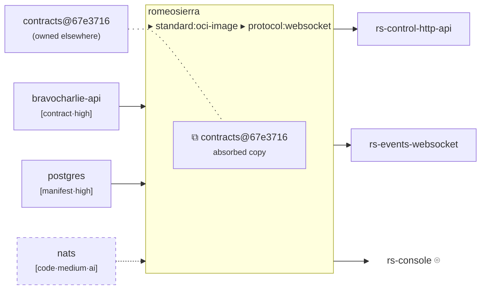
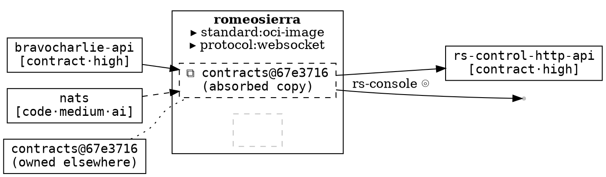
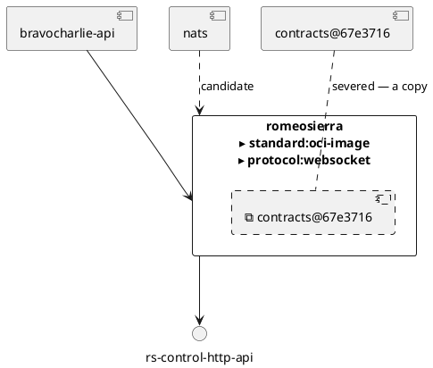

# Renderers — the conformance matrix

Read this **after** the user has picked a format. Each format is emitted in its own fenced block (SKILL.md
*Output*), so a renderable format still renders where it lands. The picture is beholden to no rendering
technology — this file names **roles** (boundary, arrow, ball, socket, badge, severed line, empty box,
world terminator) and shows how each format realizes them. **ASCII (§3) is the default and the reference
realization**; the rest are offered on the menu.

**A format is acceptable if and only if it can honour every mark this particular ledger needs.** If it
cannot, say so and offer an alternative. **Never silently degrade a mark** — an absorption drawn as an
ordinary consumed arrow is not a simplification, it is a lie.

---

## 1. The seven marks

Every format must realize these, or be rejected for a ledger that needs them:

| Mark | Means |
|---|---|
| **boundary** | an inside and an outside — the primitive |
| **ball** (arrow out) | provides — supply |
| **socket** (arrow in) | consumes — demand |
| **badge** (on the boundary) | implements — conformance, **no counterparty** |
| **severed line** | absorbs — a copy that will drift, **no live connection** |
| **empty box** | a hole — a member we could not read |
| **candidate stroke** | evidenced, not committed — visibly distinct from a committed edge |
| **world terminator** | a user-facing surface: it crosses out and **ends**, at no node |

---

## 2. The matrix

`full` = native. `good` = faithful, idiomatic. `approx` = honest compromise, disclose it. `—` = cannot.

| | ASCII | Mermaid | Graphviz DOT | SVG | PlantUML |
|---|---|---|---|---|---|
| boundary (inside/outside) | full | good (`subgraph`) | full (`cluster`) | full | good (`rectangle`) |
| opposing provides/consumes faces | full | good (`flowchart LR`) | good (`rankdir=LR`) | full | approx (layout engine decides) |
| badge on the boundary | full | **approx** (subgraph label) | full (HTML label row) | full | **approx** (stereotype/note) |
| **severed line** | full | good (`-.-`, no arrowhead) | full (`style=dotted, arrowhead=none`) | full | good (`..`) |
| present-but-empty box | full | good | full | full | good |
| candidate stroke | full | full (`-.->` + class) | full | full | good |
| world terminator | full | **approx** (shared marker) | full (`shape=point`) | full | **approx** |
| **tooling to RENDER** | none | none (MD viewers do it) | `dot`, to rasterize | none | **local renderer needed** |
| **tooling to READ** | **none** | none (source is text) | none (source is text) | **none** (any browser) | none (source is text) |

**The two that can never violate rule 7** (stands alone, no tooling, no server): **ASCII** and **SVG**.

- **ASCII is the default.** No tool to render, no tool to read, every mark native.
- **SVG is the choice for publication** — a standalone file an external reader opens in any browser.
- **Mermaid** is the choice when the picture lives in a merge request or a markdown doc.
- **DOT** is the choice when layout quality matters most and a pinned `dot` is available.
- **PlantUML** has the closest native ball-and-socket notation, but needs a local renderer. **A
  PlantUML *server* is not an option** — that is the forbidden server dependency.

Rasterizing is always optional and always needs a **trusted-source, exact-version-pinned** tool
(`npx @mermaid-js/mermaid-cli@<version>`, never an `apt`/`brew` binary). **The source text is the
deliverable**; an image is a convenience.

---

## 3. ASCII — the reference realization

### Where the legend goes — at the **bottom**, and only the glyphs used

**Fixed placement: the legend closes the picture block, it does not open it.** The order inside every
picture block is:

1. the **provenance header** comment (`# entity · view · @rev · derived — regenerate, do not edit`),
2. the **picture** — the point, immediately under the header,
3. the **legend**, as a footer.

Not the top. The picture is what the reader came for; a top legend pushes it below a screen of keys and,
in a multi-picture render (a release emits one picture per environment), separates the key from all but
the first. **One legend at the foot of the block serves every picture in that block** — and because it
lives *inside* the block, it travels when the caller copy-pastes.

**Print only the glyphs the picture actually uses.** A boundary view with no absorption and no hole does
not carry the `╎╎╎` or `▢` rows. The inline trust tags (`[contract·high]`) already let a reader weigh a
claim without a lookup, so the legend is a reference for the *marks*, not a preamble to memorize — keep
it to what appears. Omit it entirely only for a trivial picture (a lone provided ball, say).

The full glyph set, to draw from:

```text
  ┌─┐ │ └─┘   boundary
  ─────▶      a COMMITTED crossing
  ╌╌╌╌╌▶      a CANDIDATE crossing, firm evidence     (confidence: high)
  ╌╌╌╌╌▷      a CANDIDATE crossing, normal evidence   (confidence: medium)
  ┈┈┈┈┈▷      a CANDIDATE crossing, weak evidence     (confidence: low)
  ╎╎╎         a SEVERED line — an absorbed copy; no live connection
  ╎⧉?         a SEVERED stub to an UNNAMED source — this surface may be a copy,
              and the ledger does not say whose
  ▸           an implements badge (no arrow, no counterparty)
  ⧉           an absorbed twin, held inside the boundary
  ▣           internalized infra — a Resource the construct DEPLOYS (inside the box)
  ▢           a hole — a member present but unreadable
  ⌾           terminates at the world (a human counterparty; never a node)
  [prov·conf] trust: provenance · confidence (·ai when discovery mode is ai)
```

Hold the glyph→meaning mapping **constant across renders** — a reader learns it once.

**Two channels, encoded without collapsing them.** Commitment is the **dash**: solid = committed,
dashed = candidate, always and everywhere. Confidence is the **weight and head**: heavy dash + filled
head (`╌╌▶`) = high, light dash + hollow head (`╌╌▷`) = medium, sparse dash + hollow head (`┈┈▷`) =
low. So a reader can see *"this is not committed"* and *"but we are sure of it"* at once — which is
exactly what a `contract`-sourced, `high`-confidence candidate means, and it is information the ledger
paid to keep. **Never let confidence turn a dashed stroke solid**; that would promote a candidate to an
edge in the one channel that must not lie.

**Hoist a uniform stamp instead of repeating it.** When *every* fact in the picture shares a trust
token — all `mode: ai`, say — state it **once in the legend** rather than appending `·ai` to eighty
tags. The channel is preserved and the picture stays readable:

```text
  Every fact in this picture is `interface.discovery/mode: ai`, so `·ai` would appear on
  all 88 tags — it is stated once here instead.
```

Do this only when the token is **genuinely uniform**. The moment one fact differs, tag them all.

**Level 0 — a component:**

```text
# romeosierra · boundary view (L0) · from catalog-info.yaml @ v1.7.0 · derived — regenerate, do not edit

   CONSUMES                    ┌────────────────────────────────┐              PROVIDES
   (needs)                     │          romeosierra           │              (offers)
                               │                                │
   bravocharlie-api ─────────▶ │  ▸ standard:oci-image          │ ──────▶ rs-control-http-api  [contract·high]
      [contract·high]          │  ▸ platform:kubernetes-helm-…  │ ──────▶ rs-events-websocket  [contract·high]
   postgres         ─────────▶ │  ▸ protocol:websocket          │ ──────▶ rs-tracks-grpc       [contract·high]
      [manifest·high]          │                                │
   nats             ╌╌╌╌╌╌╌╌▷  │  ⧉ ABSORBED                    │ ──────▶ rs-console  ⌾        [code·medium]
      [code·medium·ai]         │     contracts@67e3716          │            (user-facing: ux:web-ui)
                               │                                │
   contracts (elsewhere)       │                                │
      ╎╎╎╎╎╎╎╎╎╎╎╎╎╎╎╎╎╎╎╎╎╎╎▶ │                                │
      [contract·high]          └────────────────────────────────┘

   ╌╌▷ candidate: evidenced, not committed as an edge
   ╎╎╎ severed: contracts@67e3716 is owned elsewhere; we hold a copy; nothing connects them
   ⌾   terminates at the world — the counterparty is a human, not a catalogued entity
```

**Level 1 — a release with members and holes:** see `reduction.md` §1 for the shape. Empty boxes are
holes; mated pairs are drawn faint and stay inside.

---

## 4. Mermaid

`flowchart LR`. The boundary is a `subgraph`; consumes enter from the left, provides leave to the
right. Hold that convention.



**Two disclosed approximations:**

- **The badge.** Mermaid has no "mark on the boundary," so conformances go in the **subgraph label**.
  They are still not arrows and still have no counterparty — the rule holds. Do **not** give a
  conformance its own node; that would make it look like a counterparty.
- **The world terminator.** Mermaid cannot draw a dangling edge, so a user-facing surface ends at a
  borderless, fill-less `world` node bearing the surface's own name and `⌾`. It is a **boundary
  marker, not an entity** — never name it after a person, a team, or "users".

**The severed line** is `---` (no arrowhead) restyled to a wide dash via `linkStyle`. It must be
visibly *broken* and must carry **no arrowhead** — an arrowhead implies the live connection that is
precisely what is absent.

---

## 5. Graphviz DOT

The best structural fit after ASCII: `cluster` is a genuine boundary, and `shape=point` gives a true
dangling terminator.



`arrowhead=none` on the severed edge is **not optional**. An arrowhead asserts a live connection.

---

## 6. SVG

Full control, and the best answer for an external reader: a standalone file, opened by any browser,
with no tooling and no network.

- **boundary** — a `<rect>`; members nest as inner `<rect>`s.
- **ball / socket** — `<path>` with a `marker-end` arrowhead; a small `<circle>` (ball) or open arc
  (socket) at the boundary.
- **badge** — `<text>` inside or on the boundary rect. Never a node, never an arrow.
- **severed line** — `<path stroke-dasharray="2 8">` with **no `marker-end`**, and a visible gap.
- **empty box** — a dashed `<rect>` with no children. Do not put a `?` in it; the emptiness *is* the
  content.
- **candidate** — `stroke-dasharray="5 5"`, lighter `stroke-opacity`.
- **world terminator** — the path simply **ends**, with an open arrowhead in whitespace. This is the
  only format where rule 5 is satisfied *literally*.

Embed the provenance header as a `<title>` **and** as visible `<text>`, so it survives being screenshot.

---

## 7. PlantUML

Closest to UML: native ball-and-socket. Offer it, with the caveat.



**The caveat, and it is load-bearing:** PlantUML needs a renderer. A **local, pinned** one is fine. A
**PlantUML server is not** — sending the diagram to a server to be drawn reintroduces exactly the
server dependency that rule 7 forbids, and it means the picture is only complete inside a running
service. If no local renderer is available, the `.puml` source still stands alone as text — but say so
rather than implying an image is coming.

---

## 8. Before you emit — the checklist

Run these against your own output, in every format:

- [ ] **Every entity in the ledger is accounted for.** Count them. For a `System`, did you sweep for
      inbound `spec.system` refs? A `System` has no `dependsOn`, so its Resources — the database, the
      broker, the object store, the cluster — are reachable **only** that way, and they are usually the
      **highest-confidence facts in the file**. An empty consumes/infra face on a real release is
      almost always this bug, not a real absence.
- [ ] Every `implements` is a **badge**. None became an arrow or a node. *(rule 3)*
- [ ] Every absorption has a **severed, arrowhead-free** line. None was drawn as a consumed arrow. *(rule 4)*
- [ ] Every candidate is **visibly distinct** from a committed edge — and **none was omitted**. *(rules 1, 4-principle)*
- [ ] Every hole is an **empty box**. None was filled with a name from the parent's manifests. *(rule 2)*
- [ ] Every user-facing surface **ends at the world**. No node represents a human. *(rule 5)*
- [ ] `provides` and `consumes` are on **opposing faces**, in the same orientation as the last render.
- [ ] **No review state, no contradiction, no federation counter appears anywhere.** This is not a
      review surface.
- [ ] The picture block opens with the **provenance header**: entity · view · ledger revision ·
      `derived — regenerate, do not edit`.
- [ ] The **legend is at the bottom** of the block (never the top), lists **only the glyphs used**, and
      one legend covers all pictures in a multi-picture block. *(§3)*
- [ ] The **could-not-determine block is present and ends with `Nothing else`** — never omitted. A
      caveat you only said in the chat does not travel. In particular — did you declare the
      **unattributed copies** and the **user-facing gap**?
- [ ] Everything is in **fenced blocks**, copy-pasteable — the picture in its format's fence, the
      explanation and caveats alongside (separate blocks are fine).
